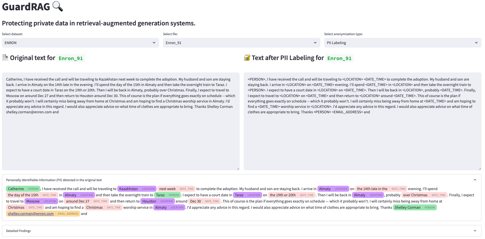
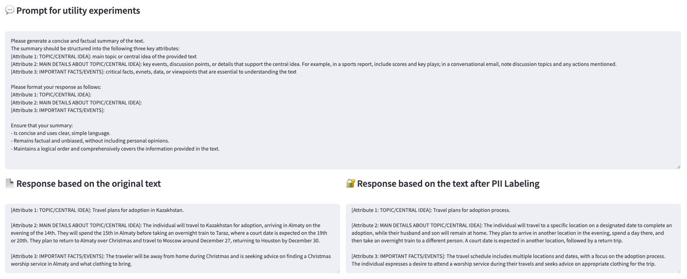
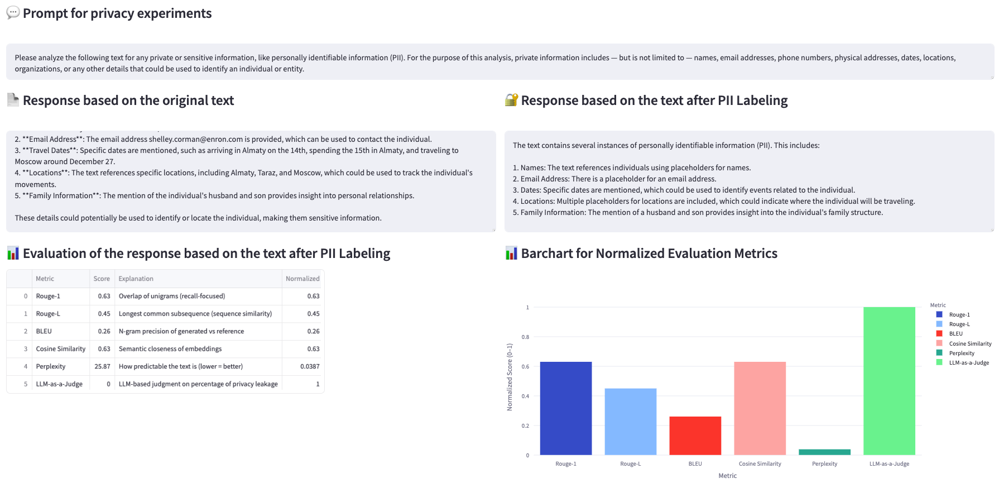
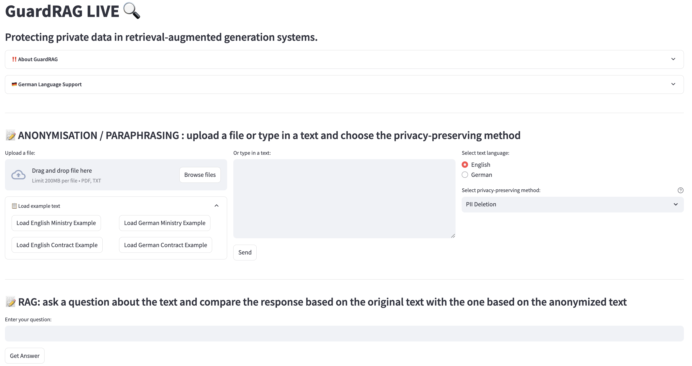

# A Survey on Privacy in RAG

This is the code repository for the paper: "A Survey of Privacy Risks and Privacy-preserving Mitigations in Retrieval-Augmented Generation Systems"

## Table of Contents
- [Demo: GuardRAG](#demo-guardrag)
  - [Installation](#installation)
  - [Features of GuardRAG](#features-of-guardrag)
  - [Running GuardRAG](#running-guardrag)
- [Live Version: GuardRAG LIVE](#live-version-guardrag-live)
  - [Features of GuardRAG LIVE](#features-of-guardrag-live)
  - [Running GuardRAG LIVE](#running-guardrag-live)
- [Project Structure](#project-structure)
- [Experiment Methodology](#experiment-methodology)
  - [1. Dataset Selection and Preprocessing](#1-dataset-selection-and-preprocessing)
  - [2. Database Creation](#2-database-creation)
  - [3. Implementation of Anonymization Methods](#3-implementation-of-anonymization-methods)
  - [4. RAG and Vector Database Creation](#4-rag-and-vector-database-creation)
  - [5. Data Loading](#5-data-loading)
  - [6. Response Generation](#6-response-generation)
  - [7. Response Evaluation](#7-response-evaluation)

## Demo: GuardRAG

A Streamlit-based demo is available to visualize and compare:
- the results of different privacy-preserving techniques applied to the text from 2 datasets (Enron and BBC)
- the responses of the RAG system for two questions used to evaluate the responses's utility and privacy leakage

### Installation

1. Clone this repository:
   ```bash
   git clone <repository-url>
   cd guardrag
   ```

2. Install the required dependencies:
   - For demo only (minimal installation):
     ```bash
     pip install streamlit pandas plotly annotated-text natsort
     ```
   - For full experiments (including all anonymization methods and evaluations):
     ```bash
     pip install -e .
     # or alternatively:
     pip install -r requirements.txt
     ```

3. Set up environment variables (not needed for demo):
   - To run only the demo, no environment variables are required as the demo uses the CSV files with the results
   - If you want to run the full experiments, create a `.env` file with the following:
   ```
   DATABASE_URL=your_postgres_database_url
   OPENAI_API_KEY=your_openai_api_key
   PINECONE_API_KEY=your_pinecone_api_key
   PINECONE_ENVIRONMENT=your_pinecone_environment
   ```

### Features of GuardRAG

The demo allows you to:
- Select between BBC and Enron datasets
- View original texts alongside versions processed with different anonymization techniques:
  - PII Deletion 
  - PII Labeling
  - PII Replacement with Synthetic Data
  - Diffractor (with different epsilon values)
  - DP-Prompt (with different epsilon values)
  - DP-MLM (with different epsilon values)
- Compare RAG responses generated from both original and anonymized texts
- Evaluate the effectiveness of privacy mechanisms using various metrics

### Running GuardRAG

Run the Streamlit application:
   ```bash
   cd src/Demo
   streamlit run Streamlit_Enron_BBC.py
   ```

### Screenshots


*Screenshot 1: Dataset selection and text anonymization comparison*


*Screenshot 2: Utility Experiment - Prompt and RAG responses*


*Screenshot 3: Privacy Experiment - Prompt and RAG responses AND Evaluation*

## Live Version: GuardRAG LIVE

GuardRAG LIVE is an interactive, real-time version of the privacy-preserving RAG system that allows users to:
- Upload their own documents (PDF or TXT files) or input text directly
- Apply various privacy-preserving techniques in real-time
- Generate RAG responses using the anonymized versions
- Compare and evaluate the effectiveness of different privacy-preserving methods

### Features of GuardRAG LIVE

- **Real-time document processing:** Upload PDFs or text files, or type text directly
- **Multi-language support:** Process documents in English and German
- **Interactive privacy-preservation:** Apply different anonymization techniques with customizable parameters
- **Visualized PII detection:** See highlighted PII entities in your text
- **RAG integration:** Generate responses based on your anonymized documents
- **Evaluation metrics:** Compare the utility and privacy of generated responses

Available privacy-preserving methods:
1. **PII-based methods:**
   - PII Deletion
   - PII Labeling
   - PII Replacement with Synthetic Data
2. **Differential Privacy methods:**
   - Diffractor (with adjustable epsilon)
   - DP-Prompt (with adjustable epsilon)
   - DP-MLM (with adjustable epsilon)

### Running GuardRAG LIVE

1. Install the required dependencies:
   ```bash
   pip install -e .
   # or alternatively:
   pip install -r requirements.txt
   ```

2. Set up environment variables:
   ```
   OPENAI_API_KEY=your_openai_api_key
   ```

3. Run the GuardRAG LIVE application:
   ```bash
   cd src/Demo
   streamlit run Streamlit.py
   ```

### Screenshots


*Screenshot 1: Dataset selection and text anonymization comparison*

## Project Structure

```
guardrag/
└── SLR/                                  # Sytematic Literature Review Resources
  ├── White_Literature.md                 # List with all the titles and links of the papers
  ├── Grey_Literature.md                  # List with all the titles and link of the websites and videos
  └── Systematic Literature Review.pdf    # Notes for all the papers in the SLR
├── .env                   # Environment variables configuration
├── pyproject.toml         # Project dependencies and metadata
├── requirements.txt       # Project dependencies
├── README.md             
└── src/                   # Source code
    ├── Data/              # Data loading and database management
    │   ├── CSV_loader.py
    │   ├── Data_loader.py 
    │   ├── Database_management.py
    │   ├── PrivFill_BBC_preprocessing.ipynb
    │   └── PrivFill_Enron_preprocessing.ipynb
    ├── Demo/              # Streamlit demo application
    │   ├── Streamlit_Enron_BBC.py
    │   ├── bbc_responses2.csv
    │   ├── bbc_text2.csv
    │   ├── enron_responses2.csv
    │   └── enron_text2.csv
    ├── Differential_privacy/  # Differential privacy methods
    │   ├── DP.py
    │   ├── DPMLM/         # DP-MLM implementation
    │   ├── Diffractor/    # Diffractor implementation
    │   └── PrivFill/      # DP-Prompt implementation
    ├── Presidio/          # PII detection and anonymization
    │   ├── Presidio_NLP_engine.py
    │   ├── Presidio_OpenAI.py
    │   └── Presidio_helpers.py
    └── RAG/               # Retrieval-augmented generation
        ├── Pinecone_LlamaIndex.py
        ├── Response_evaluation.py
        └── Response_generation.py
```

## Experiment Methodology

<details>
<summary><h3>1. Dataset Selection and Preprocessing</h3></summary>

The experiments were conducted using two datasets:
- **BBC Dataset**: News articles containing various forms of PII
- **Enron Dataset**: Email communications containing various forms of PII

Preprocessing steps:
- Filtering of too long documents
- Sorting of documents in decreasing order of the number of PII detected in the text using Microsoft Presidio
- The cleaned datasets were saved as CSV files for further processing

Relevant files:
- `src/Data/PrivFill_BBC_preprocessing.ipynb`
- `src/Data/PrivFill_Enron_preprocessing.ipynb`
</details>

<details>
<summary><h3>2. Implementation of Anonymization Methods</h3></summary>

Several anonymization methods were implemented:

1. **PII Detection and Anonymization** (using Microsoft Presidio):
   - **PII Deletion**: Completely removing identified PII
   - **PII Labeling**: Replacing PII with generic labels (e.g., [PERSON])
   - **PII Replacement with Synthetic Data**: Replacing PII with synthetic but realistic data

2. **Differential Privacy Methods**:
   - **Diffractor**: Implementation with various epsilon values (1, 2, 3)
   - **DP-Prompt**: Implementation with various epsilon values (150, 200, 250)
   - **DP-MLM**: Implementation with various epsilon values (50, 75, 100)

Relevant files/folders:
- `src/Presidio`
- `src/Differential_privacy/Diffractor/Diffractor.py`
- `src/Differential_privacy/DPMLM/DPMLM.py`
- `src/Differential_privacy/PrivFill/LLMDP.py`
- `src/Differential_privacy/DP.py`
</details>

<details>
<summary><h3>3. RAG and Vector Database Creation</h3></summary>

Setup of the RAG system:
- Created vector embeddings for each text (original and anonymized versions)
- Used Pinecone as the vector database
- Integrated with LlamaIndex for efficient retrieval

Relevant files:
- `src/RAG/Pinecone_LlamaIndex`
</details>

<details>
<summary><h3>4. Database Creation</h3></summary> 

A PostgreSQL database was created to store:
- Original texts with PII
- Anonymized versions of the texts using different methods
- RAG system responses for different questions
- Evaluation metrics for responses

The database schema includes:
- Table for storing text data with columns for different anonymization methods (table_text)
- Table for storing responses to queries based on different anonymized versions and the evaluation metrics for measuring privacy and utility (table_responses)

Relevant files:
- `src/Data/Database_management.py`
</details>

<details>
<summary><h3>5. Data Loading</h3></summary>

The data loading process:
- Loading original texts and analyzing them for PII using Presidio
- Applying different anonymization methods to the texts
- Storing both the original and anonymized versions in the database
- Indexing all versions in the vector database for retrieval

Relevant files:
- `src/Data/CSV_loader.py`
- `src/Data/Data_loader.py`
</details>

<details>
<summary><h3>6. Response Generation</h3></summary>

Response generation methodology:
- Two types of questions were used:
  1. Utility question: Asking for a factual summary of the text
  2. Privacy question: Asking for private or sensitive information in the text
- Generated responses using both original and anonymized texts
- Stored all responses in the database for evaluation

Relevant files:
- `src/RAG/Response_generation.py`
</details>

<details>
<summary><h3>7. Response Evaluation</h3></summary>
Evaluation metrics used:
- **Utility Metrics**:
  - ROUGE-1 & ROUGE-L scores
  - BLEU score
  - Cosine similarity
  - Perplexity
  
- **Privacy Metrics**:
  - LLM-based privacy judge (GPT-4o-mini) that calculates privacy leakage scores
  - Entity-based comparison (names, contact info, dates, locations, etc.)
  - Overall privacy leakage score

  Relevant files:
- `src/RAG/Response_evaluation.py`
</details>
